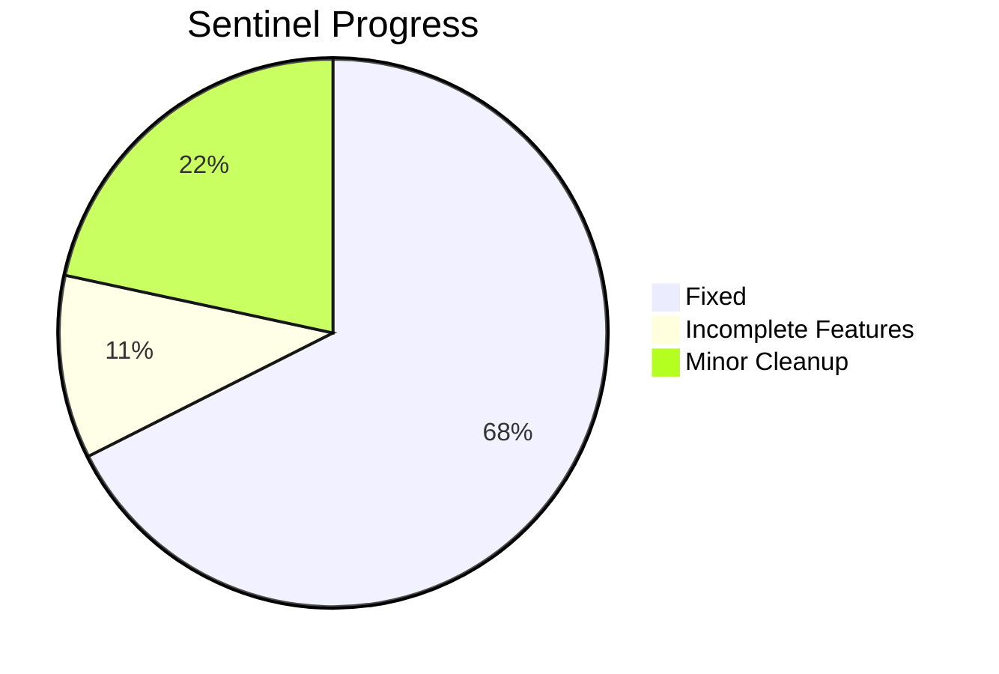

# Sentinel — Remaining Issues (Final)

> All critical, major, and fix-introduced issues are now resolved. Only incomplete features and minor cleanup remain.

## ✅ Round 3 Fixes Verified

| # | Fix | Status |
|---|---|---|
| W1 | Auth re-exported from [index.ts](file:///d:/Sentinel/src/gateway/src/index.ts), imports changed to `@shared/utils`, deps added | ✅ |
| W2 | `incident.manual_created` Kafka key uses `incident.id` | ✅ |
| W3 | Analyzer route wraps the refactored function properly | ✅ |
| W4 | [aiAnalyzer()](file:///d:/Sentinel/src/services/firewall-service/src/kafka/consumer.ts#9-61) called in firewall server startup | ✅ |
| I1 | Input validation added in ingest controller | ⚠️ See V1 |

---

## ⚠️ One Small Bug in Validation

#### V1. Ingest Validation Will Crash if `logs` Is Undefined

**File:** [ingestLogs.ts](file:///d:/Sentinel/src/services/firewall-service/src/controllers/ingestLogs.ts#L5-6)

```typescript
const {logs} = req.body;
if(!logs.source || !logs.severity || !logs.message){  // ← TypeError if logs is undefined
```

If the client sends an empty body or omits `logs`, destructuring gives `undefined`, and accessing `.source` on it throws `TypeError: Cannot read properties of undefined`.

**Fix:** Add a null check first:
```typescript
const { logs } = req.body;
if (!logs || !logs.source || !logs.severity || !logs.message) {
    return res.status(400).json({ message: "Invalid logs: source, severity, and message are required" });
}
```

---

## 🟡 Remaining Implementations

These are feature completions — the core pipeline is now correct.

| # | What | Where | How |
|---|---|---|---|
| I2 | Un-comment system events in [sanitizeLogs()](file:///d:/Sentinel/packages/shared-utils/src/sanitizeLogs.ts#24-109) | [sanitizeLogs.ts:76-85](file:///d:/Sentinel/packages/shared-utils/src/sanitizeLogs.ts#L76-85) | Un-comment the `system_events` insert. Note: you'll need to pass an `incident_id` into the function for this to work — currently it's not available at sanitization time. Consider doing it after the incident is created instead. |
| I3 | Add policy violation Kafka events | [sanitizeLogs.ts](file:///d:/Sentinel/packages/shared-utils/src/sanitizeLogs.ts) or firewall producer | When policies trigger, produce a `policy.violation` event to Kafka so other services can react |
| I4 | Add Express + health endpoint to audit & notification services | [audit server.ts](file:///d:/Sentinel/src/services/audit-service/src/server.ts), [notification server.ts](file:///d:/Sentinel/src/services/notification-service/src/server.ts) | Add `const app = express(); app.get('/health', ...); app.listen(port)` |
| I5 | Apply auth middleware to incident routes | [incident server.ts](file:///d:/Sentinel/src/services/incident-service/src/server.ts) | Import [authenticate](file:///d:/Sentinel/packages/shared-utils/src/authMiddleware.ts#10-23) from `@shared/utils` and apply to protected routes |

---

## 🟢 Minor Cleanup

| # | What | How |
|---|---|---|
| Q3 | `concurrently` not installed | `npm install -D concurrently` in root |
| Q4 | Hardcoded email sender `bengupta786@gmail.com` | Change to `process.env.EMAIL_FROM` in [email.ts](file:///d:/Sentinel/src/services/notification-service/src/integrations/email.ts) |
| Q5 | Seed passwords are plaintext | Use `await bcrypt.hash(...)` in [01_users.ts](file:///d:/Sentinel/packages/shared-utils/src/db/seeds/01_users.ts) |
| Q8 | Empty [producer.ts](file:///d:/Sentinel/src/services/audit-service/src/kafka/producer.ts) in audit & notification | Delete [audit](file:///d:/Sentinel/src/services/audit-service/src/kafka/producer.ts), [notification](file:///d:/Sentinel/src/services/notification-service/src/kafka/producer.ts) |
| Q9 | Commented-out code everywhere | Clean up old code in [rateLimiter.ts](file:///d:/Sentinel/src/gateway/src/middlewares/rateLimiter.ts), [firewall consumer](file:///d:/Sentinel/src/services/firewall-service/src/kafka/consumer.ts), [gateway routes](file:///d:/Sentinel/src/gateway/src/routes/incidents.routes.ts) |
| Q10 | `dist/` folders in version control | Add `dist/` to [.gitignore](file:///d:/Sentinel/.gitignore) and remove tracked dist files |
| Q11 | Old auth middleware files still exist | Delete [gateway/authMiddleware.ts](file:///d:/Sentinel/src/gateway/src/middlewares/authMiddleware.ts), [user-service/authMiddleware.ts](file:///d:/Sentinel/src/services/user-service/src/middlewares/authMiddleware.ts), [incident-service/authMiddleware.ts](file:///d:/Sentinel/src/services/incident-service/src/middlewares/authMiddleware.ts) — now consolidated in `@shared/utils` |

---

## Summary of What's Done vs. What's Left



**Your core event pipeline is now architecturally sound.** The remaining items are feature completions and housekeeping — none are blockers for running the system locally.
